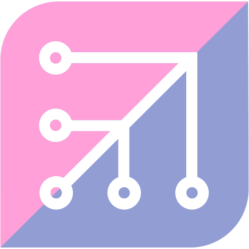

# Goldenblue

Basically Fedora Silverblue, except my own golden image version of it... get it?

With thanks to [uBlue](https://ublue.it/) and [Seraphim Strub](https://dev.rievo.net/sst/uphy) for inspiring much of the work in this repo.

### Usage Instructions

1. Install [Fedora Silverblue](https://fedoraproject.org/silverblue/) from bootable ISO.
2. Log into Container Registry via Podman:
```sh
run0 podman login git.infected.systems:5050
```
3. Copy the `auth.json` so that `rpm-ostree` will find it:
```sh
run0 cp -v /run/containers/0/auth.json /etc/ostree/auth.json
```
4. Reset our overlays (if we're using localisation then we might have packages that get automatically layered like `langpacks-en_GB`, which can cause problems when rebasing):
```sh
run0 rpm-ostree reset
```
5. Rebase to Goldenblue (without validating signatures, so we can import the sigs):
```sh
run0 rpm-ostree rebase ostree-unverified-image:docker://git.infected.systems:5050/infectedsystems/goldenblue:41
```
6. Reboot
7. Now we can switch to validating signatures on the Goldenblue image:
```sh
run0 rpm-ostree rebase ostree-image-signed:docker://git.infected.systems:5050/infectedsystems/goldenblue:41
```
5. Reboot

### Notes
To configure local Distrobox containers, run:
```sh
distrobox assemble create --replace --file /etc/distrobox/distrobox.ini
```

To enter a Distrobox container, enter one of the following:
```sh
distrobox enter fedora
distrobox enter ubuntu
distrobox enter wolfi
```

The BlackBox terminal emulator (installed via Flatpak by Yafti) is configured in `dconf` to start up using `distrobox enter fedora` as the initial command, so opening the BlackBox shortcut will drop you directly into an Fedora Distrobox. This is also mapped to the `Ctrl` + `Alt` + `F` desktop shortcut using `dconf`.

### Debugging
To debug whether any core issues you are facing are part of a custom image or also exist upstream, you can temporarily rebase on the upstream Silverblue image like so:
```sh
run0 rpm-ostree rebase ostree-image-signed:docker://quay.io/fedora/fedora-silverblue:40
```

### Caveats
* This image is not currently built for `aarch64`. I'm aiming to fix this in future.
* I cannot offer any support for this image. You're on your own here if you try and use it.
